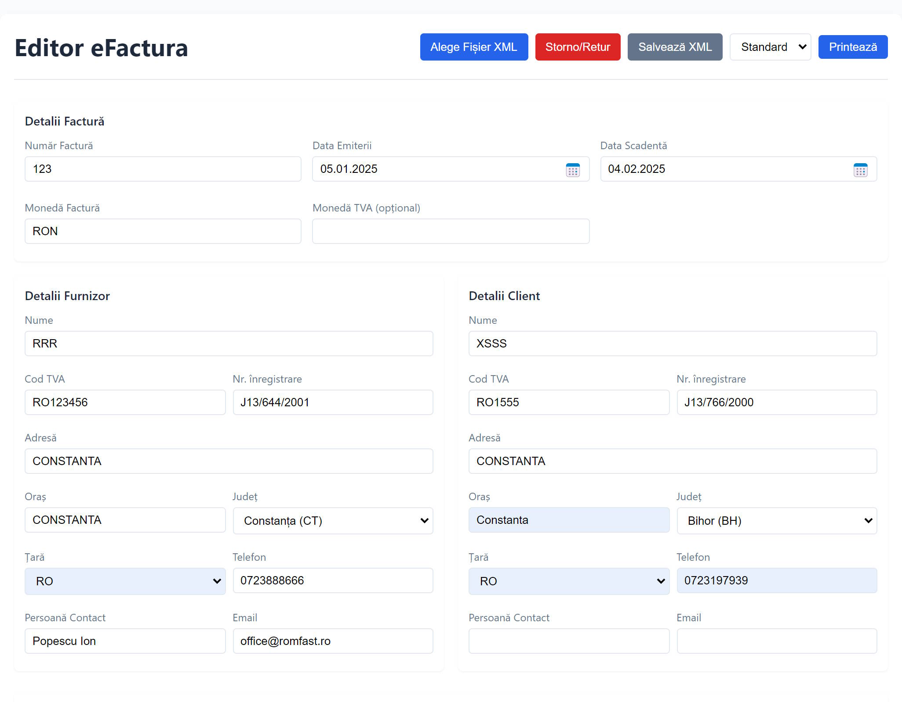
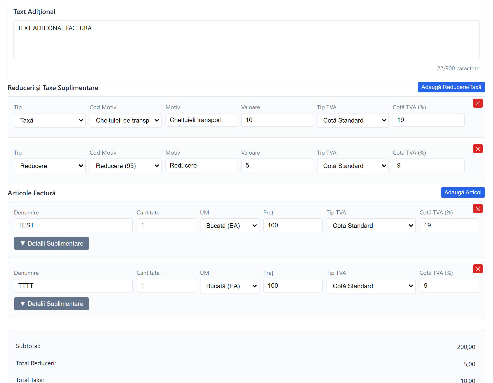
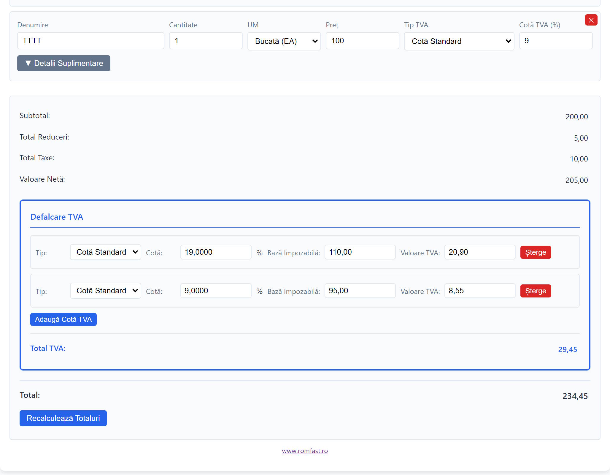

# Editor eFactura

Editor static în browser pentru fișiere XML eFactura (UBL 2.1) conforme cu standardul ANAF.

## Demo

- GitHub Pages: https://romfast.github.io/efactura-generator/

## Scop

Aplicația este intenționat **statică** (HTML + CSS + JavaScript, fără build, fără backend obligatoriu) astfel încât să poată fi găzduită direct pe GitHub Pages sau pe orice server web simplu.

Cazurile principale de utilizare:
- **Corecții minore** într-un XML eFactura existent (date factură, furnizor, client, articole, TVA).
- **Generare factură storno** pornind de la o factură existentă, prin butonul „Stornează”.

Nu este un sistem complet de facturare — lucrează cu câte un singur XML, încărcat și salvat local.





## Funcționalități

### Încărcare XML
- Încărcare fișier XML local prin butonul „Alege Fișier XML”.
- Încărcare automată dintr-un fișier temporar prin parametru URL (`index.html?xml=<nume_fisier>`), folosit împreună cu `receiver.php` pentru integrare cu sisteme externe.

### Detalii factură
- Număr factură, data emiterii, data scadentă (cu calendar Pikaday și format `dd.mm.yyyy`).
- Monedă document și monedă TVA opțională (cu generarea automată a celui de-al doilea tag `TaxTotal` când monedele diferă).
- Câmp text adițional (notă) cu limită de 900 de caractere și împărțire automată.

### Furnizor și client
- Nume, cod TVA, număr de înregistrare, adresă, oraș, județ, țară, telefon, persoană de contact, email.
- Selector de țară conform ISO 3166-1 și selector de județ conform codurilor `RO-XX`.
- Tratare specială pentru București și pentru furnizori neplătitori de TVA (cod fiscal fără atributul `RO`).

### Articole factură
- Adăugare, editare și ștergere articole.
- Cantitate, preț, cotă TVA, unitate de măsură (EA, XPP, H87, KGM, MTR, LTR, MTQ).
- Reduceri pe linie cu cod și motiv reducere.
- Coduri de identificare articole multiple per linie: cod vânzător, cod cumpărător, cod de bare, CPV, NC8, cod vamal.

### TVA
- Tipuri TVA suportate: `S` (Standard), `AE` (Taxare Inversă), `O` (Neplătitor TVA), `Z` (Cotă 0%), `E` (Neimpozabil).
- Coduri de scutire `VATEX-EU-*` cu motiv corespunzător, completate automat în funcție de tipul TVA și editabile manual.
- Defalcare TVA cu mai multe cote, editabilă inline (bază impozabilă și valoare TVA).

### Reduceri și taxe la nivel de factură
- Adăugare/editare/ștergere reduceri și taxe suplimentare la nivel de document.
- Coduri motiv pentru reduceri (95, 41, 42, 60, 62 etc.) și pentru taxe (TV, FC, ZZZ).

### Totaluri
- Recalculare automată: subtotal, total reduceri, total taxe, valoare netă, TVA, total.
- Editare inline a totalurilor (click pe valoare) cu păstrarea totalurilor originale din XML-ul încărcat.
- Buton „Recalculează Totaluri” pentru regenerare din articole.

### Storno
- Buton „Stornează” care convertește factura curentă într-o factură storno (cantități și valori negative) gata de salvat.

### Salvare și printare
- Buton „Salvează XML” care generează și descarcă un XML UBL conform.
- Vizualizare printabilă în două formate (standard și compact) prin șabloanele din `templates/`.

### Formatare
- Numere, cantități și sume formatate conform locale-ului browserului, cu conversie automată la punct decimal pentru XML.

## Instalare și utilizare

### Opțiunea 1: Server web static
Copiați toate fișierele pe serverul web păstrând structura directoarelor și accesați `index.html` prin URL-ul serverului. Funcționează pe orice server static (Apache, nginx, GitHub Pages etc.).

### Opțiunea 2: Dezvoltare locală cu Node.js
```bash
node js/server.js
```
Apoi deschideți http://localhost:3000

Serverul Node este minimal (fără dependințe) și servește doar fișierele statice.

### Opțiunea 3: Integrare cu sistem extern (PHP)
Pentru a primi un XML dintr-o aplicație externă și a-l deschide direct în editor:
1. Configurați `config.json` (cheie API, IP-uri permise, durată de viață fișiere temporare).
2. Sistemul extern face POST cu conținutul XML către `receiver.php`, transmițând antetul `X-Api-Key`.
3. `receiver.php` validează XML-ul și namespace-urile UBL, salvează în `temp/` și returnează numele fișierului.
4. Utilizatorul este redirecționat către `index.html?xml=<nume_fisier>`, care încarcă XML-ul automat.
5. Fișierul temporar este șters după încărcare; fișierele mai vechi decât `temp_file_lifetime` ore sunt curățate automat.

Pentru diagnosticare există pagina `test-config.php`.

## Structura proiectului

```
efactura-generator/
├── index.html              # Pagina principală
├── styles/main.css
├── js/
│   ├── script.js           # Logica completă: parsare/generare XML, formular, totaluri
│   ├── formatter.js        # Formatare numere/sume/cantități
│   ├── print.js            # Generare vizualizare printabilă
│   └── server.js           # Server static minimal pentru dezvoltare locală
├── templates/
│   ├── print.html          # Șablon printare standard
│   └── print-compact.html  # Șablon printare compact
├── receiver.php            # Endpoint opțional pentru încărcare XML din sisteme externe
├── test-config.php         # Pagina de diagnosticare pentru receiver
├── config.json             # Configurație receiver (API key, IP-uri permise)
└── .htaccess.template      # Configurație Apache pentru hosting în producție
```

## Licență

[AGPL-3.0-or-later](LICENSE.md)

Dacă folosiți acest software, chiar și ca serviciu web, trebuie să:
1. Menționați proiectul original.
2. Partajați toate modificările făcute.
3. Folosiți aceeași licență AGPL-3.

## Linkuri

- [Istoric modificări](CHANGELOG.md)
- [De făcut](TODO.md)
- [www.romfast.ro](https://www.romfast.ro)
